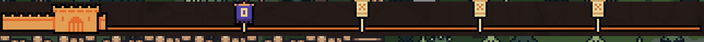
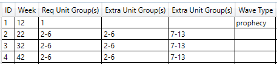

# TKIW_RunBuilder
This is a simple windows WPF application to build custom unit/wave configurations for the game "The King is Watching" [Steam Page](https://store.steampowered.com/app/2753900/The_King_is_Watching/)

# Main Feautres
+ Ability to make custom Wave Templates, which determine when flags appear, and when prochecies or shops happen after a flag event. This is done by creating custom Wave_template files.
	+ Can import exsisting Wave Templates modtify them and then export them to be used in game

+ Ability to make custom Unit Groupings, the Unit Groupings file is used by the Wave Templates file. Each flag in the Wave Templates file is given an id (or a range of ids to be randomly chosen from) that is spawned for that wave.
	+ Can import exsisting Unit Groupings modtify them and then export them to be used in game

# Missing feautres
Still need to add images to most units in the Unit Groupings unit drop down.

# How to Use
The use of this tool requires a basic understanding of how the Wave Templatess and Unit Groupings tables work and interact with each other. Information on these tables can be found below. 
You can import a Wave Templates or Unit Grouping from your TKIW game files (typically called "Wave_template*" or "Wave_prests*" respecfully)
You can make edits to both tables by editing the value in in the rows. dropdowns are added when a value must be one of a collection. 
You can export your edited tables as new Wave_template and Wave_prests, add them to your The King is Watching\parameters folder named Wave_template_{levelName}.csv or Wave_prests_{levelName}.csv and when loading that level in game your new data will be pulled in.

## Unit Groupings
The Unit Grouping table is used to make group of units (crazy i know). each row of the table contains an id number and 1-6 diffrent units and the quantity of said unit. 

The id's of this table are then used in the Wave Templates file to determine what units will spawn on the enemy side.

### Example
in the games Wave_prests_village.csv file if you import this the first row is
|id|unit|qty|unit|qty|unit|qty|unit|qty|unit|qty|unit|qty|
|---|---|---|---|---|---|---|---|---|---|---|---|---|
|1|goblin_bandit|1|||||||||||

This creats a group of units with id 1. this group of units consit of a single goblin bandit. 

## Wave Templates
The Wave Templates table is used in game to determine when and what kind of flags show up in a game

All rows have an id (row number), week the wave spawns, and one or more required unit group id's. 
	+ wave unit group(s) have the following format.
		+ if you want 1 unit group to always spawn the unit group column should be the unit group id of the group you want to spawn
		+ if you want a random unit group and the groups are in sequance use a dash "-" and a random id will be choosen from that range (inclusive)
			+ so if you want a flag to spawn a random group with group id 2,3,4, or 5 put "2-5" in the unit group column
		+ if you want a random unit group and the groups are not in sequance use a comma and add all groups
			+ if you want a flag to spawn a random group with group id 2,5,7, or 9  put "2,5,7,9" in the unit group

Rows can also have special wave types including prophecy, shop and boss.

### Boss
Super simple, this determines the crystal ball screens coming and going (you can spawn a boss in a unit group and not tag the wave type as boss.)

### Shop
Simple, triggers a shop even after the wave is defeated

### Prophecy
Triggers a propecy even after the wave is defeated. the following rules apply.
+ There should be at least 3 waves following a prophecy.
	+ In the prophecy event the units you can choose for the next 3 waves are determined by the data in the Wave Templates table in the 3 rows after the prophecy.
	+ The blue unit groups in the prophecy select screen that each wave must contain one of is selected from the first unit grouping column Req Unit Group(s)
	+ The yellow unit groups that give medium rewards in the prophecy select string are taken from the first Extra Unit Group(s)
	+ The red unit groups that give large rewards in the prophecy select string are taken from the second Extra Unit Group(s)

#### Prophecy example
In the below table row 1 is a prophecy wave and will be guranteed to spawn the unit group with id 1.
when the prophecy event is triggered the blue required wave will all be randomly selected from unit groups in the range 2-6 (req unit group(s) column)
The yellow waves in the prophecy even will be randomly selected from unit groups in the range 2-6 (the first extra unit group(s) column)
Finally 2 red waves will be randomly selected from unit groups in the range 7-13 (the second extra unit group(s) column)

I am unsure if the selection is based on all 3 rows after a prophecy or just the first as the base files that I have looked at have the same unit groups in all 3 rows after a prophecy. I have only tested with the same unit groups in all 3 rows after a prophecy. I will update the readme when I have more information.